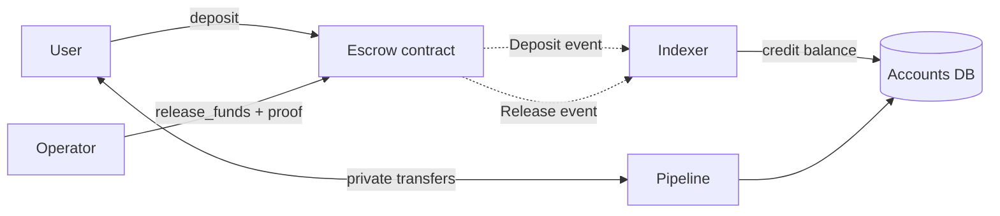

# Integrating the Escrow Contract with the Off-Chain Channel

What the backend has to build to drive this contract, and the details that must
match exactly. Written for `cell-protocol` (gateway, pipeline, indexer).

The contract is the verifier. The backend is the prover: it decides *what* to pay
and proves each withdrawal is paid *once*. Neither half works alone, and today
only the verifier exists.

## 1. Division of labour



| Responsibility | Where |
|---|---|
| Custody, mint gating, operator set | contract |
| Verify a withdrawal is unspent, mark it spent | contract |
| Decide who gets paid and how much | backend |
| Build the tree, generate sibling paths | backend |
| Allocate nonces | backend |
| Track spent nonces durably | backend |

## 2. What the backend must build

Nothing in `cell-protocol` touches the tree today. Three pieces are missing.

### 2.1 An SMT prover

Mirror `contracts/escrow/src/smt.rs`. Every parameter below is load-bearing;
getting one wrong makes every proof fail with `InvalidSmtProof` (`#6`) and gives
no hint which one.

| Parameter | Value |
|---|---|
| Node hash | `SHA256(left ‖ right)`, raw 64-byte concatenation, no prefix |
| Empty leaf | 32 zero bytes, not a hash |
| Spent leaf | `SHA256([0x01; 32])` |
| Height | 16, so 65 536 leaves per tree |
| Leaf position | `nonce mod 65536` |
| Path order | **least-significant bit first** |
| Empty root | `8fe6b1689256c0d385f42f5bbe2027a22c1996e110ba97c171d3e5948de92beb` |

Path order is the one people get wrong. At level `l`, bit `l` of the leaf
position decides whether the running node is the left (`0`) or right (`1`) child.
A most-significant-first generator produces paths that verify against nothing.

The prover must expose:

- `insert(nonce)`: mark spent, recompute the root, `O(16)`
- `exclusion_proof(nonce) -> [[u8; 32]; 16]`: the sibling path, taken **before**
  insertion
- `remove(nonce)`: undo an insert when the transaction fails to land
- `reset(tree_index)`: start a fresh tree
- `root()`

Sparse storage is what makes this cheap: keep only occupied positions and collapse
every empty subtree to a precomputed per-level constant. The reference
implementation does exactly this in
`indexer/src/operator/utils/smt_util.rs` of `solana-private-channels`.

**Validate against `contracts/escrow/vectors/smt_vectors.json`** before trusting
it. Eight cases covering the empty tree, low-bit nonces, the last leaf, a wrapped
nonce and paths with occupied siblings. Those exact proofs have been accepted by
the deployed contract on testnet, so reproducing the file is sufficient.

### 2.2 Durable tree state

The in-memory tree must survive restarts, and it must agree with the chain.
Postgres needs at least:

- the spent nonces of the current generation
- the current `tree_index`
- the last root submitted

`migrations/0001_init.sql` has nothing for this yet.

**Reconcile on startup and after every failure.** Read `root()` and
`tree_index()` from the contract and compare against the locally computed values.
If they disagree, stop and do not submit. A prover that has drifted produces
algorithmically valid proofs against the wrong tree, and every one is rejected.

### 2.3 Nonce allocation

A nonce carries its own generation. The contract enforces:

```
nonce / 65536 == tree_index
```

So nonces run in blocks of 65 536, one block per generation:

| Generation | Valid nonces |
|---|---|
| 0 | 0 ... 65 535 |
| 1 | 65 536 ... 131 071 |
| *n* | `n * 65536` ... `n * 65536 + 65535` |

Allocate them monotonically inside the current block and never reuse one. When
the block is exhausted, rotate.

This is what makes replay impossible across rotations: after rotating to
generation 1, a generation-0 nonce is rejected with `WrongTreeGeneration` (`#8`)
even though its leaf is empty again in the new tree.

## 3. Call flow

### Deposit

The user calls `deposit` themselves; the backend only watches.

```
deposit(from, mint, amount)   [auth: from]
  → Deposit event
  → indexer credits the channel balance
```

Credit only on a confirmed event, and make it idempotent on the transaction hash.
The existing handler in `crates/indexer/src/handlers/deposit.rs` already does the
idempotency part.

### Withdrawal

```
1. backend picks (to, amount) and allocates nonce = tree_index * 65536 + next
2. siblings  = prover.exclusion_proof(nonce)          // before inserting
3. new_root  = root after prover.insert(nonce)
4. release_funds(operator, mint, to, amount, nonce, new_root, siblings)
5. on SUCCESS  → mark settled, keep the insert
   on FAILURE  → prover.remove(nonce), leave the nonce burnt, do not reuse it
```

Step 5's failure path matters. If the transaction does not land and the local
tree keeps the insert, every later proof is built on a root the chain never
adopted, and nothing settles again until the state is rebuilt.

### Rotation

```
reset_smt_root(operator, expected_tree_index)   [auth: operator]
```

Rotate when the generation's nonces are used up. `expected_tree_index` is the
generation being replaced; if it does not match, the call is rejected with
`UnexpectedTreeIndex` (`#9`). That guard exists because a rotation landing twice
would advance the counter again and strand a whole generation.

Rotating early is safe for the contract but throws away the rest of the block:
any nonce already allocated and not yet settled becomes unusable.

## 4. Events

Published with `#[contractevent]`: the first topic is the struct name in **lower
snake case**, and the data body is a `Map<Symbol, Val>` keyed by field name.

| Event | Topics | Data |
|---|---|---|
| `Deposit` | `("deposit", from, mint)` | `amount`, `total_locked`, `ledger` |
| `Release` | `("release", to, mint)` | `amount`, `nonce`, `new_root`, `ledger` |
| `Rotate` | `("rotate",)` | `tree_index`, `new_root` |
| `AdminChanged` | `("admin_changed", previous, next)` | `ledger` |
| `OperatorSet` | `("operator_set", operator)` | `enabled`, `ledger` |
| `MintSet` | `("mint_set", mint)` | `allowed`, `ledger` |
| `Upgraded` | `("upgraded",)` | `new_wasm_hash` |

Addresses are topics so the indexer can subscribe per user or per asset.

**The current indexer will not match these.** `crates/indexer/src/handlers/mod.rs`
routes on `"Deposit"` and `"Settlement"` in PascalCase and reads `from` out of the
data map. Against this contract the name is `"deposit"` and `from` is topic 1.
`RawEvent::topic(i)` already exists for that, unused.

## 5. Submitting the call

`cell_core::stellar::soroban` already builds, simulates, signs, submits and polls
a Soroban invocation. Two things need repointing:

- `settle_args` encodes a provisional `settle(batch_id: u64, total: i128)` for a
  withdraw contract that does not exist. Withdrawals go through the escrow's
  `release_funds`.
- The argument encoding for `release_funds` is
  `(Address, Address, Address, i128, u64, BytesN<32>, Vec<BytesN<32>>)`, in
  order: operator, mint, to, amount, nonce, new_root, siblings.

Simulation is where a bad proof surfaces: the contract error comes back from
`simulateTransaction` before anything is submitted, so a failed proof costs
nothing. Treat a simulation error as final and do not retry the same proof.

## 6. Error codes

| Code | Meaning | Usual cause |
|---|---|---|
| 2 | `NotAuthorized` | caller is not a registered operator |
| 3 | `MintNotAllowed` | asset never allowed, or blocked mid-flight |
| 4 | `InvalidAmount` | amount ≤ 0 |
| 5 | `InvalidProofLength` | not exactly 16 siblings |
| 6 | `InvalidSmtProof` | wrong path, wrong bit order, stale tree, or a replay |
| 7 | `InsufficientLocked` | releasing more of an asset than is held |
| 8 | `WrongTreeGeneration` | `nonce / 65536` ≠ installed `tree_index` |
| 9 | `UnexpectedTreeIndex` | rotation submitted against a stale index |
| 10 | `InvalidRecipient` | payout target is the escrow itself |

`#6` is the ambiguous one. Before suspecting the contract, check the prover
against `smt_vectors.json`, if those pass, the problem is tree state, not the
algorithm.

## 7. Trust boundary

The tree stops a withdrawal being settled twice. It does **not** authorize the
withdrawal: the spent leaf is a constant, so a proof binds neither recipient nor
amount. Both rest entirely on the operator's signature.

An operator that signs a wrong payout is not caught by the contract, only the
totals are, since a release can never exceed `TotalLocked` for that asset. That is
the v1 model: the operator is trusted to be honest and bounded to be solvent. See
`escrow-design.md` §8 for what changing this would take.

## 8. Checklist

- [ ] SMT prover reproducing `smt_vectors.json`
- [ ] Postgres tables for spent nonces, `tree_index`, last submitted root
- [ ] Startup reconciliation against on-chain `root()` and `tree_index()`
- [ ] Nonce allocator honouring the generation blocks
- [ ] Rollback on failed submission
- [ ] Indexer routing on lower snake case names, reading addresses from topics
- [ ] `release_funds` encoding replacing the provisional `settle_args`
- [ ] Rotation when a generation is exhausted
